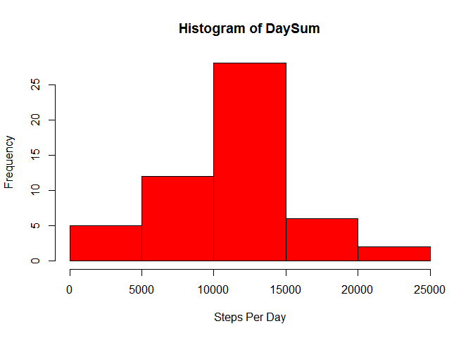
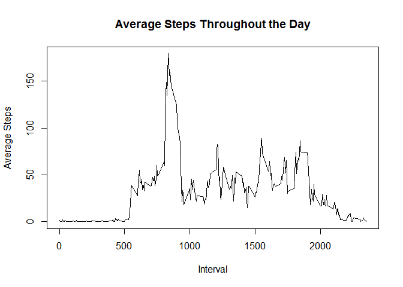
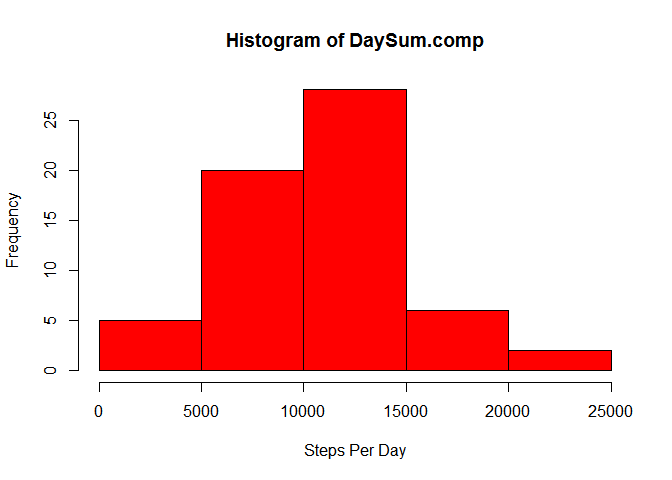
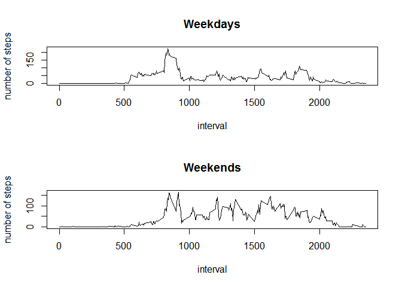

# Reproducible Research: Peer Assessment 1


## Loading and preprocessing the data
First we will set the WD and read in the data and set all NA values to 0

```r
setwd("~/coursera/RR/RepData_PeerAssessment1")
data <- read.csv("activity.csv")
data$date <- as.Date(data$date)
check <- is.na(data$steps)
data.NA <- data
data.NA[check,1] <- 0
```


## What is mean total number of steps taken per day?

```r
DaySum <- tapply(data.NA$steps, data.NA$date, sum)
```

Let's view the data in a histogram

```r
hist(DaySum, col = "red", xlab = "Steps Per Day")
```

 

The median and mean steps taken per day:

```r
mean(DaySum)
```

```
## [1] 9354.23
```

```r
median(DaySum)
```

```
## [1] 10395
```


## What is the average daily activity pattern?
Now lets look at the average activity for a given interval.  First we will calculate the average and then plot it.

```r
IntAvg <- tapply(data.NA$steps, data.NA$interval, mean)
plot(names(IntAvg), IntAvg, type ="l", xlab = "Interval", ylab = "Average Steps", main = "Average Steps Throughout the Day")
```

 


## Imputing missing values
The total number of missing values in the dataset

```r
sum(check)
```

```
## [1] 2304
```
let's fill in those missing data points in a new dataset called `data.comp` with the average of that interval for the rest of the dataset

```r
data.comp <- data
data.comp[check,1] <- IntAvg[as.character(data[check,3])]
```
And lets view the histogram, mean and median of this data:

```r
DaySum.comp <- tapply(data.comp$steps, data.comp$date, sum)
hist(DaySum.comp, col = "red", xlab = "Steps Per Day")
```

 

```r
mean(DaySum.comp)
```

```
## [1] 10581.01
```

```r
median(DaySum.comp)
```

```
## [1] 10395
```

As you can see there is a significant impact on the data when estimated values are used instead of missing values:

- The Mean and Median both increase
- the number of 0 step days decreases
- the number of steps per day increases accross the board.


## Are there differences in activity patterns between weekdays and weekends?
Using the complete data `data.comp` we will now evaluate if there is a difference in activity on weekdays vs weekends.

```r
day <- weekdays(data.comp$date)
check.day <- day == "Saturday" | day == "Sunday"
day[check.day] <- "weekend"
day[!check.day] <- "weekday"
data.comp <- cbind(data.comp, as.factor(day))
```

Now lets look at this data graphically

```r
data.day <- subset(data.comp,day == "weekday")
IntAvg.day <- tapply(data.day$steps,data.day$interval, mean)

data.end <- subset(data.comp,day == "weekend")
IntAvg.end <- tapply(data.end$steps,data.end$interval, mean)

par(mfrow = c(2,1))
plot(names(IntAvg.day),IntAvg.day, type = "l", main = "Weekdays", xlab = "interval", ylab = "number of steps")
plot(names(IntAvg.end),IntAvg.end, type = "l", main = "Weekends", xlab = "interval", ylab = "number of steps")
```

 
